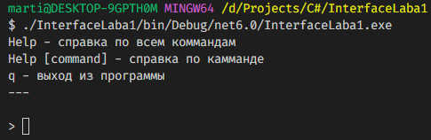
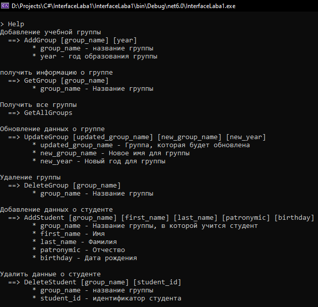
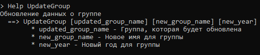
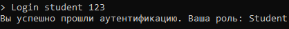
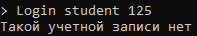
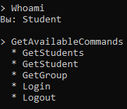
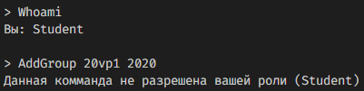
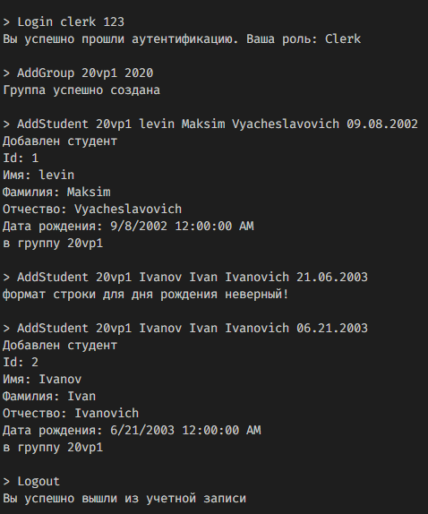
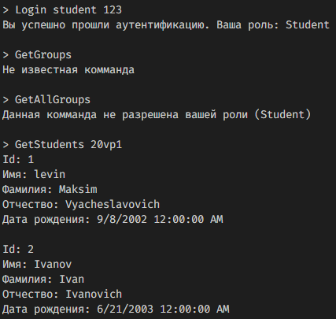
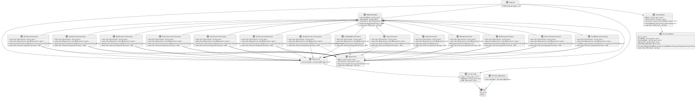

# Лаба по командному интерфейсу (предметная область: "Деканат")

## Задание 
Создать консольное приложение, основанное на командах

## Готвая программа

### Начальный экран

 

### Вывод справки для всех команд (Help)

 

### Вывод справки конкретной команд (Help UpdateGroup)

 

### Успешная Аутентификация

 

### Ошибка Аутентификация

 

### Получение разрешенных команд для роли «студент»

 

### Попытка выполнить не поддерживаемую команду

 

### Секретарь добавил группу 20vp1 и в нее двух студентов

 

### Студент получил список студентов из ранее созданной группы 20vp1

 

### Диаграмма классов svg ([svg rider](https://www.svgviewer.dev/))
